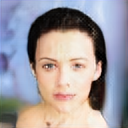

# Pioneer Networks


...


...


...



...


Code for the paper ["Pioneer Networks: Progressively Growing Generative Autoencoder"](https://arxiv.org/abs/1807.03026) [1].

Implementation by Ari Heljakka. Some code directly borrowed from [2] and [3]. The h5tool was adapted from [4].

## Reproducing the paper results

The GIT revision with tag 'v1.0-ACCV' can be used to reproduce the results of [1].

The master branch of this repository may continue to be updated. The newest commit will always attempt to be *better* than the official revision, but not guaranteed stable, due to the relatively long training period for each dataset. So if you encounter any problems, please try out the v1.0-ACCV.

## Pre-requisites

Tested with:
* Ubuntu 16.04
* Python 3.5
* CUDA v9.0.176
* PyTorch v0.3.1 (no issues have been found with v0.4+ as of this writing, but support is not confirmed).

The batch sizes have been selected to enable running on 12 GB of GPU memory. Up to 8 GPUs are supported, but only the 1-GPU setup has been thoroughly tested. Please ensure enough disk space for checkpoints.

For detailed Python package configuration used, see requirements.txt.


## Quick start
```
# 1. Download the CelebA (aligned, cropped) dataset (remember to separate the train/test later).

# 2. Train the first 4k iterations of CelebA at 4x4:

python train.py -d celeba --save_dir celeba64_quicktest --train_path /data/celeba --test_path /data/celeba --sample_N=128 --reconstructions_N=10 --interpolate_N=3 --max_phase=4 --total_kimg=512

# 3. Wait 5-10 minutes (on P100 or equivalent).
# 4. Done. Now, celeba64_quicktest/reconstructions* files should seem to have learned fairly precise reproduction of face images - at 4x4 resolution. The image at (row 1, col 1) is the 1st source image; image at (row 1, col 2) is its reconstruction; image at (row 1, col 3) is the next source image, etc.)
```

## Known issues:

The memory management has known issues which will be fixed on the forthcoming PyTorch 0.4 update. If you enable training-time samples, it can produce out-of-memory crashes on higher resolutions. If so, please try removing all training-time tests (`--sample_N=0 --interpolate_N=0 --reconstructions_N=0`).

Note that all loss function hyper-parameters in the code base are scaled by a factor of 0.1 in comparison to the paper.

Random sampling should work on all datasets. But, as in the paper, reconstructions and interpolations can be expected to work only in CelebA-64 and 128 (not even CelebA-HQ). There is a theory of what needs to be fixed; work-in-progress.

Training of CelebA is very stable, but with other datasets, unstable outcomes are not impossible (requiring restart). If you see consistently unstable training for a network (more than 50% of the time) despite following the instructions here, please contact us.

## Datasets

Supported datasets are:
- CelebA
    - Choose the aligned & cropped version; also, you still need to do the train/test split into separate directories manually.
- LSUN bedrooms
    - Used as normal. Please bear in mind the very long time on first run of any LSUN usage to just build the index (many hours).
- CIFAR-10
- CelebA-HQ
    - You need to put the dataset in H5 format for PyTorch, separately for training and testing, as follows:
        1) Download the CelebA dataset (originals, NOT the aligned & cropped one)
        2) Download the Delta files from the author https://github.com/tkarras/progressive_growing_of_gans (see "Data files needed to reconstruct the CelebA-HQ dataset")
        3) Run the dataset-tools/h5tool.py we provide (which contains the train/test split unlike the original CelebA-HQ script). For the syntax, run
            ```
            python h5tool.py -h
            ```
        Please run first `data_split=train`, then `data_split=test`. This will create a separate 27k/3k split for training and testing.

## Dependencies
```
pip install -r requirements.txt
```
If you use TensorboardX, please run
```
pip install tensorboardx
```
Otherwise, you need to provide the command-line argument `--no_TB`.

## Usage

For all command-line arguments, run
```
python train.py -h
```

Below, examples for typical use cases are given. For other arguments, the defaults should be fine.

To resume training from a checkpoint, it is sufficient to add `--start_iteration==N` where N is the step number of your latest state file (eg. for `checkpoint/256000_state`, N=256000)

## Testing

You can test trained models by giving its directory as `save_dir`. The checkpoints are saved under `[save_dir]/checkpoint`.
All examples show a sample checkpoint step count in the `start_iteration` argument.

### Intermediate samples, reconstructions and interpolations from separate datasets and models:
1. CelebA, 64x64:
```
python train.py -d celeba --start_iteration=25000000 --save_dir final_models/celeba/64 --test_path /data/celeba_test --sample_N=256 --reconstructions_N=10 --interpolate_N=3 --max_phase=4 --testonly
```

2. CelebA, 128x128:
```
python train.py -d celeba --start_iteration=35000000 --save_dir final_models/celeba/128 --test_path /data/celeba_test --sample_N=256 --reconstructions_N=10 --interpolate_N=3 --max_phase=5 --testonly
```

### Intermediate samples:

1. CelebA-HQ, 256x256:
```
python train.py -d celebaHQ --start_iteration=43200000 --save_dir final_models/celeba/256 --sample_N=16 --max_phase=6 --testonly
```

2. LSUN, 128x128:

```
python train.py -d lsun --start_iteration=35000000 --save_dir final_models/lsun/128 --sample_N=128 --max_phase=5 --testonly
```

3. CIFAR, 32x32:

```
python train.py -d cifar10 --save_dir=final_models/cifar10 --start_iteration=15400000 --test_path=~/data/cifar10 --sample_N=128 --max_phase=3 --reconstructions_N=0 --testonly
```

### Test reconstruction of existing (any) images:

1. CelebA 64x64:

```
python train.py -d celeba --start_iteration=100000 --save_dir final_models/celeba/64 --reconstructions_N=10 --max_phase=4 --testonly --aux_inpath metrics/celeba/64_paper_originals --aux_outpath out64
```

2. CelebA 128x128:

```
python train.py -d celeba --start_iteration=40000 --save_dir final_models/celeba/128 --force_alpha=1.0 --reconstructions_N=6 --max_phase=5 --testonly --aux_inpath /data/aalto --aux_outpath /src/PINE/src/PINE/out128
```

### Test interpolation of existing (any) images:
1. CelebA 64x64:
```
python train.py -d celeba --start_iteration=100000 --save_dir final_models/celeba/64 --reconstructions_N=0 --interpolate_N=3 --max_phase=4 --testonly --aux_inpath celeba/64_paper_originals/ --aux_outpath celeba/out64
```

2. CelebA 128x128:
```
python train.py -d celeba --start_iteration=40000 --save_dir final_models/celeba/128  --reconstructions_N=0 --interpolate_N=6 --max_phase=5 --testonly --aux_inpath /celeba/128_paper_originals --aux_outpath celeba/out128
```

### Dump training samples:

Dump a subset of a training (or testing) set as separate images, for computing Fréchet Inception Distance and other metrics. You can vary the exact phase and alpha to see the fade-in effects.

1. CelebA 64x64:
```
python train.py -d celeba --dump_trainingset_N=20 --dump_trainingset_dir=ref64_20 --start_phase=4 --force_alpha=1.0 --train_path /data/celeba
```
2. CelebA-HQ, 256x256:
```
python train.py -d celebaHQ --dump_trainingset_N=20 --dump_trainingset_dir=ref256_20 --start_phase=6 --force_alpha=1.0 --train_path  /data/celeba_train.h5
```

## Training up to a specific resolution

The maximum resolution is defined via the `max_phase` argument, in powers of 2, as follows:
0 = 4x4,
...,
3 = 32x32,
4 = 64x64,
5 = 128x128,
6 = 256x256


1. CelebA, up to 64x64:
```
python train.py -d celeba --save_dir celeba64_quicktest --train_path /data/celeba --test_path /data/celeba_test --sample_N=128 --reconstructions_N=10 --interpolate_N=3 --max_phase=4 --total_kimg=25000
```

2. CelebA-HQ, 256x256:
```
python train.py -d celebaHQ --save_dir celebaHQ_quicktest --train_path /data/celebaHQ_train.h5 --test_path /data/celebaHQ_test.h5 --sample_N=0 --reconstructions_N=0 --interpolate_N=0 --max_phase=6 --total_kimg=43200
```

3. Cifar-10, 32x32, no progression:
```
python train.py -d cifar10 --save_dir cifar32-0817 --train_path=~/data/cifar10 --test_path=~/data/cifar10 --total_kimg=35000 --max_phase=3 --no_TB --no_progression --total_kimg=15400
```

When the progressive training is disabled, your kimg counter starts from where the normal count would have been if the progressive training would be ON. Hence, if the counter would initially be at, say, 8400 kimg, and you wish to actually train for 7000 kimg, then use `--total_kimg=15400`.

Note: The model is not optimized for CIFAR training, and the nature of the dataset makes it less stable to train in this setup than the other datasets. You may have to take the best intermediate training result rather than the last one.

## Continue training a pre-trained model with custom schedule

Normally, a model is given a `max_phase` (eg. phase 4, 64x64), trained until that phase, and then the training continues until convergence.
Then, if you wish to use this model as a pre-trained model for the next phase (e.g. phase 5, 128x128), then you must run the training script with the following extra information:
```
--step_offset=[ the number of steps taken on previous runs ]
# Use step_offset=-1 if you want to use the last training step of the pre-trained model. Notice, however, that if you train the new phase in several stages, and reload in between, you have to use the explicit count here.

--phase_offset=[ how many phases have been omitted ]
# Use phase_offset=1 when moving from 64x64 to 128x128]
```

E.g.
```
python train.py -d celeba --save_dir celeba128_final --train_path ~/data/celeba --test_path ~/data/celeba_test --sample_N=128 --reconstructions_N=8 --interpolate_N=0 --max_phase=5  --total_kimg=37000 --start_iteration=-1 --step_offset=26280000 --phase_offset=1
```

At the start of each training session, the actual alpha and phase are calculated as:
```
phase = floor((step - step_offset) / images_per_stage) + phase_offset
alpha = max(1.0, (step - step_offset) / images_per_stage)
```

Thus, if you already have steps >= step_offset + images_per_stage, and then you restart training, you no longer should give the phase_offset.

This could easily happen if you do the final phase of training in several sessions.
In these advanced scenarios, it is recommended to double-check that the script reports the correct step count, phase and alpha when the training session starts.

## Misc

The code base also supports regular Progressive Growing of GANs as in [5], confirmed to work up to 128x128 resolution. This needs to be manually switched on in config.py by setting `args.train_mode = MODE_GAN`.

## Support

For all correspondence, please contact ari.heljakka@aalto.fi.

Support and email replies are not always guaranteed, but we will appreciate and evaluate all feedback.

## References

[1] Heljakka, A., Solin, A., Kannala, J.: Pioneer Networks: Progressively Growing Generative Autoencoder. In: Asian Conference on Computer Vision (ACCV), 2018, to appear.

[2] https://github.com/rosinality/progressive-gan-pytorch

[3] https://github.com/DmitryUlyanov/AGE

[4] https://github.com/tkarras/progressive_growing_of_gans

[5] Karras, T. and Aila, T. and Laine, S. and Lehtinen, J.: Progressive growing of GANs for improved quality, stability, and variation. In: International Conference on Learning Representations (ICLR), 2018.

## License

This software is distributed under the MIT License; please refer to the file LICENSE, included with the software, for details.
